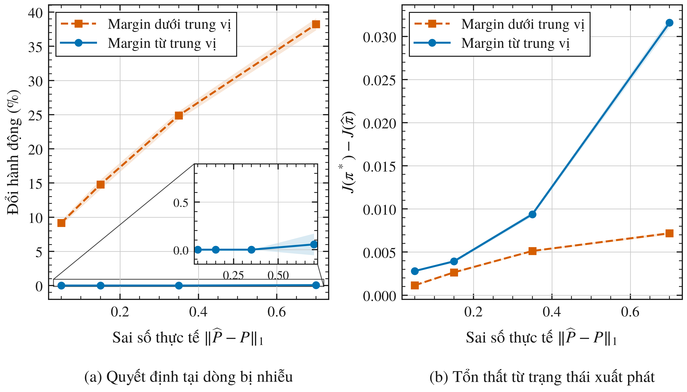

# Ảnh hưởng của sai số world model đến quyết định của tác tử

Đồ án tốt nghiệp của Phạm Quang Minh, chuyên ngành Trí Tuệ Nhân Tạo,
Trường Đại học Văn Lang. Giảng viên hướng dẫn: ThS. Nguyễn Thái Anh.

Khung thực nghiệm đo **sai số dự báo → giá trị hành động → đổi quyết định → hiệu năng**.
Phạm vi là nghiên cứu thực nghiệm nhỏ, không đề xuất thuật toán DRL mới.
[Phạm vi theo phiếu giao đề tài](docs/THESIS_SCOPE.md) và
[giao thức đầy đủ](docs/PROTOCOL.md) giải thích cấu hình, thống kê và giới hạn.

## Chạy lại

Python 3.11 được dùng cho bộ kết quả hiện tại. Từ thư mục repo:

```bash
python3 -m venv .venv
source .venv/bin/activate
python -m pip install -r requirements.txt
python -m pytest tests -q
python experiments/run_all.py
python scripts/analyze_results.py
python scripts/verify_results.py
```

`run_all.py` ghi đè bộ CSV theo cấu hình cố định: 30 seed 11k, k = 1..30.
`analyze_results.py` chỉ đọc CSV và xuất summary, PDF vector, PNG 600 dpi.
`verify_results.py` kiểm tra nguồn/dữ liệu khớp manifest cùng các bất biến thiết kế.
Thời gian và phiên bản thực tế nằm trong `results/manifest.json`.
`requirements-lock.txt` ghi phiên bản bộ chạy hiện tại; kết quả số có thể khác
khi thay nền tảng hoặc phiên bản thư viện dù dùng cùng seed.

Xuất hình và bảng vào thư mục báo cáo LaTeX riêng:

```bash
python scripts/analyze_results.py --report /path/to/report-folder
```

## Bảy thực nghiệm

| Bài | Thiết kế | Kết quả |
|---|---|---|
| GridWorld 5×5 | Nhiễu L1 có kiểm soát; cặp phản chiếu khả thi | 14.400 quan sát và 14.400 cặp; Q tối ưu, flip, policy loss |
| CartPole-v1 | 5 MLP/seed, 600 transition, 120 epoch | 60.000 điểm test; 600 rollout/policy; margin theo điểm tham chiếu thủ công |
| Baseline GridWorld 4×4 | Q-learning và Dyna-Q, 5.000 tương tác thật | Return greedy đánh giá chính xác mỗi 100 bước; nhiễu planning 0/15/35% |
| Họ 25 Fork-MDP | Cặp phản chiếu cực trị theo V*, severity ghép cặp | 1.782 cặp; giá trị sửa chữa có dấu; bootstrap cụm theo MDP |
| MuJoCo ×3 | 12 ô tiền đăng ký trên Hopper/Walker2d/HalfCheetah | Bảng 2.000 trạng thái/ô đóng băng; Spearman và AUROC tính lại trên CPU |
| CartPole-v1 held-out | 20 episode/seed sinh bởi chính sách tham chiếu | 92.750 trạng thái; điểm đặc quyền so với không đặc quyền |
| GridWorld giải chính xác | Quét khối lượng phản chiếu trên lưới đều | 600 can thiệp; đối chiếu định luật bậc nhất và ngưỡng giải tích |

Mỗi bài có thể chạy riêng bằng script `experiments/exp1_gridworld_margins.py`
đến `exp7_first_order_law.py`. Chạy riêng làm
manifest cũ không còn bảo đảm bao phủ lần chạy mới; dùng `run_all.py` để xuất
một manifest cho cả bộ.

## Kết quả và giới hạn

- Cặp phản chiếu GridWorld bão hòa ở L1 **thực tế 0,15** dù mức yêu cầu lên tới
  0,70, vì khối lượng chuyển bị chặn bởi support. Nhánh chiếu âm lên V* có
  8,5% flip tại state can thiệp; nhánh chiếu dương 0%. Nhưng loss ghép cặp
  **âm trừ dương = −0,000265, CI [−0,000300; −0,000231]**: nhánh gây flip cục bộ
  lại có loss thấp hơn. Thứ tự cục bộ và thứ tự toàn cục ngược nhau.
- CartPole có **345 flip/60.000 điểm**, đủ để AUROC xác định ở **cả 30 seed**.
  AUROC của −margin là 0,994 [0,993; 0,995], của MSE là 0,617 [0,575; 0,659];
  chênh lệch 0,377 [0,334; 0,419] không chứa 0. Không gọi đây là bảo đảm cho
  trạng thái chưa kiểm tra, và margin ở đây không phải hiệu giá trị tối ưu thật.
- Return CartPole của mô hình học trừ tham chiếu: **+1,97**, CI 95%
  **[−0,47; 4,41]**. Vẫn chứa 0 sau khi mở rộng lên 30 seed; chưa xác nhận
  tăng hoặc giảm hiệu năng ổn định.
- **Xấp xỉ bậc nhất** giải thích vì sao phép chiếu là đại lượng đúng, và vì sao
  chỉ phép chiếu thôi thì chưa đủ. Với *giá trị hành động*,
  $\widehat Q-Q\approx\gamma(\delta\cdot V^*)$ cho tương quan 0,99873 và sai lệch
  9,3%; sai lệch đó là số hạng quay lại bị bỏ, cộng lại còn 0,9%.
  Nhưng quyết định do **margin** chi phối, và margin còn chứa số hạng của hành
  động cạnh tranh với dấu ngược. Bỏ nó đi thì tương quan sụp còn **0,493**
  (sai lệch 44,5%); giữ lại thì đạt **0,99912** (sai lệch 1,24%).
  Ngưỡng đầy đủ $t_{crit}=m/(\gamma\Delta V\kappa)$ dự đoán đúng **99,8%**:
  0% flip dưới $0{,}9\,t_{crit}$, **100%** trên $1{,}1\,t_{crit}$. Bản bỏ số hạng
  cạnh tranh đạt 99,0% — đủ cao để dễ nhận nhầm là xác nhận, nhưng chỉ vì ba
  state duy nhất vượt được trần khả thi lại là ba state có $\kappa\approx1$.
- Hướng sai số **có dấu** tách biệt hệ quả khi severity đã ghép cặp: trên 25
  Fork-MDP, chênh lệch giá trị sửa chữa là **0,00894 [0,00718; 0,01083]**, dương
  ở 23/25 MDP. Nhưng dấu này **không phổ quát**: cặp phản chiếu trên GridWorld
  cho dấu ngược. Nó phụ thuộc họ MDP và cách dựng cặp ghép.
- Cổng tín hiệu quyết định trên MuJoCo **trượt**: tín hiệu hướng-quyết định xếp
  hạng sai lệch hành động **kém hơn** độ phân tán dự báo ở **12/12 ô**, phân giải
  được ở 11 ô. Tương phản âm nhất ở ô có policy mạnh nhất. Phần khẳng định: mỗi
  loại sai số vẫn có tín hiệu riêng xếp hạng nó tốt nhất.
- CartPole trên **quỹ đạo thật**: hộp trạng thái đều làm đẹp chỉ báo (AUROC
  0,994 so với 0,965). Điểm **không đặc quyền**, chỉ dùng đại lượng tác tử đã có,
  đạt 0,932 — thấp hơn nhưng vẫn dùng được. Độ phân tán dự báo dùng một mình
  không thua điểm ghép, khớp với kết quả MuJoCo.
- Dyna-Q nhiễu **35% giảm return rõ**: chênh lệch với Q-learning −2,416
  [−3,400; −1,432]. Mức 15% là −0,710 [−1,595; 0,175] và mức 0% là
  0,208 [−0,383; 0,799], cả hai vẫn chứa 0. Dyna-Q 0% nhiễu vẫn dùng mô hình
  last-sample trong MDP ngẫu nhiên, **không phải mô hình hoàn hảo**.

Giao thức mở rộng (thesis-v2: 30 seed, 2.000 điểm test/seed) được cố định
trước và chỉ chạy một lần, không lặp lại việc tăng cỡ mẫu cho tới khi đạt ý
nghĩa thống kê; các kết quả vẫn không phân giải được đều được báo nguyên trạng.
CI Student t được tính sau tổng hợp trong seed; không coi từng state là một
lần chạy độc lập. CI của tỷ lệ có thể vượt [0,1] khi ít biến cố; CI [0,0]
không chứng minh rủi ro bằng 0. CartPole dùng một hàm chấm điểm thủ công,
không phải Q* hoặc nghiệm LQR. So sánh baseline cùng tương tác thật nhưng
Dyna-Q có thêm 25.000 update planning.



## Cấu trúc

- `src/`: môi trường, quy hoạch động, can thiệp, chỉ số, mô hình, baseline.
- `experiments/`: cấu hình và bộ chạy cố định.
- `tests/`: kiểm thử môi trường, Bellman, phản chiếu, terminal và Gymnasium.
- `results/`: CSV gốc, summary và manifest SHA-256.
- `scripts/`: phân tích, xuất hình/bảng, kiểm tra kết quả.
- `docs/`: phạm vi, giao thức và ghi chú sửa lỗi.
- `docs/mujoco_provenance/`: tiền đăng ký và xuất xứ phần chạy trên GPU.
- `results/mujoco_signal_audit/`: bảng theo từng trạng thái đã đóng băng.

Báo cáo được giữ riêng trong thư mục `VLU___KLTN_HK261_TTNT_Minh` cạnh repo;
nguồn nghiên cứu mở rộng `drl-thesis` không là phụ thuộc của bộ chạy này.

## Tài liệu nền

- Sutton và Barto, [Reinforcement Learning: An Introduction](https://mitpress.mit.edu/9780262039246/reinforcement-learning/), 2018.
- Farahmand và cộng sự, [Value-Aware Loss Function](https://proceedings.mlr.press/v54/farahmand17a.html), 2017.
- [Gymnasium CartPole-v1](https://gymnasium.farama.org/environments/classic_control/cart_pole/).

## Hình giải thích và môi trường

Tám hình giải thích, sáu hình kết quả và ba hình miền/bề mặt tạo thành bộ 17 hình trong báo cáo.
Mọi hình dùng chung `scripts/figstyle.py`: vẽ đúng bề rộng chữ của báo cáo
(424,06 pt) nên LaTeX chèn ở tỉ lệ 1:1, font serif TeX Gyre Termes khớp thân
bài và đủ dấu tiếng Việt, mỗi series phân biệt bằng màu, kiểu nét và marker
để đọc được khi in đen trắng.

```bash
python -m pip install -r requirements-figures.txt
python scripts/illustrate_methods.py --report /path/to/report-folder
python scripts/plot_surfaces.py --report /path/to/report-folder
```

Hình RL, margin, ensemble và baseline là minh họa phương pháp. Bố cục
GridWorld đọc từ môi trường; cặp phản chiếu và chính sách trước–sau tái dựng
đúng RNG của bộ chạy và đối chiếu CSV. `figures/case_study.json` lưu khóa dòng,
quy tắc chọn ví dụ, chính sách và mã băm nguồn dữ liệu. CartPole gồm render
Gymnasium tại trạng thái đặt trước và sơ đồ biến trạng thái; không dùng
ảnh minh họa này để đánh giá hiệu năng.
